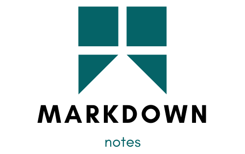
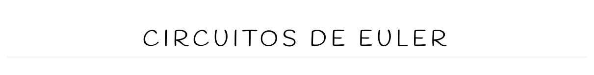
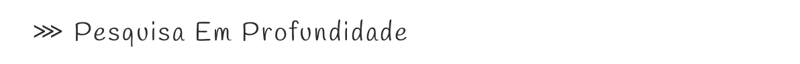
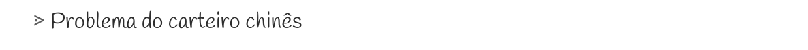
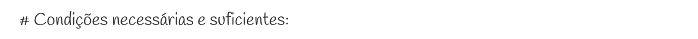
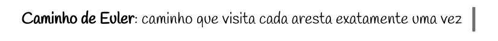
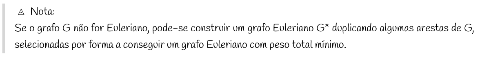
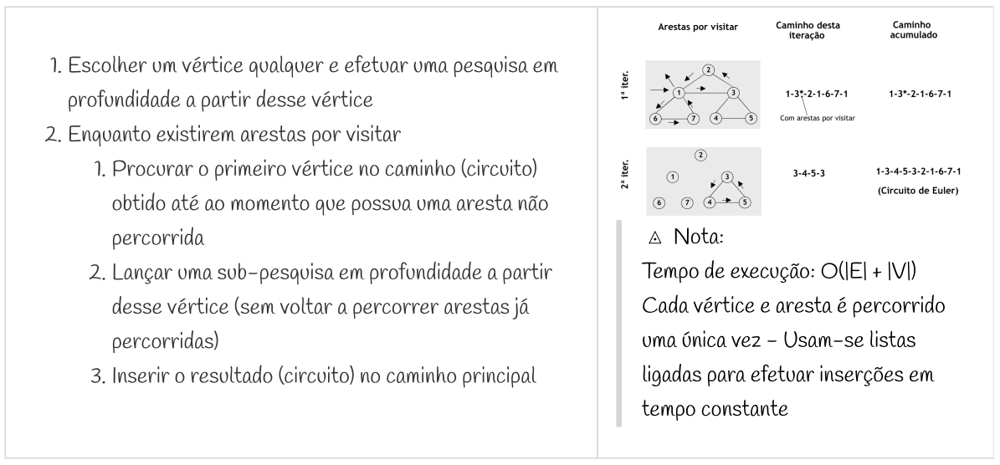

  

----

<h5 style="text-align: center;">markdown-notes</h1>

<h4 style="text-align: center;">Templates for your Note Taking Markdown Workflow</h3>

## Contents

- [Contents](#contents)
- [Overview](#overview)
- [Installation (CLI)](#installation-cli)
- [Using](#using)
  - [1. Templates Folder](#1-templates-folder)
  - [2. CLI app](#2-cli-app)
- [Examples](#examples)
- [Templates](#templates)
- [Themes](#themes)
- [Contributing](#contributing)
- [License](#license)

## Overview

**Based on some effective study methods (Feynman Technique, Flashcards, Cornell Note Taking Method, Charting Method, Split Page Method etc...), these markdown templates are designed to help on creating better study materials, faster and directly from your computer. Only markdown or html/css skills are required. The styles are fully customizable!**

All the working files are contained in these folders:
* [Templates](templates/) - for the markdown templates
* [Themes](themes/) - for the styling themes

> **Important**  
> The extension [Markdown Preview Enhanced](https://shd101wyy.github.io/markdown-preview-enhanced/#/), available for VSCode and Atom is required, not only for the notes' styled preview but also for a better html export.

This is a two versions package:

1. If you do want to install the CLI app, a simple command line interface that creates the files on your current directory, follow the instructions in the next [section](#installation-cli).  
2. Else, if you only need the templates, copy the files you need (a .md and the corresponding .less file, ex: [note.md](templates/note.md) and [note-style.less](themes/default/note-style.less)), from the previously mentioned folders, paste them wherever you want and start editing them. A Pro Tip is using your machine *Templates* or *Models* folder for a faster template creation.

## Installation (CLI)

> `node` and `npm` are required to be installed on your system. 

First, `git clone` this repo. Then go to the downloaded folder and run 

`$ npm install`  
to install the dependencies

`$ chmod +x md-notes.js`  
to make the program executable

`$ npm link`  
or  
`$ sudo npm link`  
to create a bin link and make it possible to call the program globally on your machine.

If everything went with no errors, a successful installation was accomplished.  
So... Start [using](#cli-app) it!

## Using

... Having everything set up, 

### 1. Templates Folder

If these files are on your machine *Templates* folder, you can easily spawn them on any folder using your file manager context menu.

### 2. CLI app

Else, if you installed the CLI app version, then you need only to run 

`$ md-notes` 

on your terminal in the desired directory and choose the suitable options.

----
Finally, open your Text Editor (VSCode or Atom) to start crafting and visualizing your markdown notes.

Search for a *Markdown Preview Enhanced* **Preview Button** on the top corners of your editor to open the viewer tab. Search for the extension shortcuts or buttons to export your notes to html, for then opening it on your browser and printing them to pdf.

> See [Themes](#themes) for an overview of the expected visual results

## Examples

There is a [folder](examples/) containing examples of these note templates. They were also exported to html, using the recommended VSCode/Atom extension, and then printed to pdf, directly from the browser.

## Templates

This [folder](templates/) contains all the available markdown templates to start creating and editing the notes. They may be very similar, but all of them must represent the initial header with all the necessary info for linking the styles and start writing the notes. 

> Every template must have a corresponding .less file in every available theme, following the current naming and structure.

To help on creating/editing the notes, they may provide some basic code that can be commented and/or urls for some online documentation.

The global font family is also specified in these headers.

## Themes

Currently, there are two featured themes:
+ [Default Theme](themes/default/)
+ [Minimal Theme](themes/minimal/)

More customizations may come in the future.
 Some example aspects/components of the Default Theme are:

<!--
|||
--|--
| h1 or # |  |
| h2 or ## |  |
| h3 or ### |  |
| h4 or #### |  |
| h5 or ##### | Similar to h4, but smaller. |
| h6 or ###### |   This will appear with a grey background color when previewing or in html. |
| blockquote or > |  |
| table |  |
| hr or ---- | Not displayed. It is used for page breaks when printing to pdf. |
-->

<table style="background-color: white; color: black;">

<tr>
<td>

h1 or #
</td>
<td>

</td>
</tr>

<tr>
<td>

h2 or ##
</td>
<td>

</td>
</tr>

<tr>
<td>

h3 or ###
</td>
<td>

</td>
</tr>

<tr>
<td>

h4 or ####
</td>
<td>

</td>
</tr>

<tr>
<td>

h5 or #####
</td>
<td>

Similar to h4, but smaller.
</td>
</tr>

<tr>
<td>

h6 or ######
</td>
<td>

  This will appear with a grey background color when previewing or in html.
</td>
</tr>

<tr>
<td>

blockquote or >
</td>
<td>

</td>
</tr>

<tr>
<td>

table
</td>
<td>

</td>
</tr>

<tr>
<td>

hr or ----
</td>
<td>

Not displayed. It is used for page breaks when printing to pdf.
</td>
</tr>
</table>

## Contributing

**Contributions are all welcome!** 

New templates and new themes are appreciated, as well as new features for expanding this idea or make it better, more functional. 

Whenever a new template is added, the corresponding style for every suitable theme should be also created. Follow the existing example for the Default Theme.

## License

Licensed under the [MIT license](LICENSE.txt).
