<!-- @import "note-style.less" -->

<!-- https://detexify.kirelabs.org/classify.html -->
<!-- https://shd101wyy.github.io/markdown-preview-enhanced/#/ -->

<link href="https://fonts.googleapis.com/css2?family=Handlee&display=swap" rel="stylesheet">

<!--

<table>
  <tr>
    <th></th>
    <th></th>
  </tr>
  <tr>
    <td></td>
    <td></td>
  </tr>
  <tr>
    <td></td>
    <td></td>
  </tr>
</table>

<table>
  <td></td>
  <td></td>
</table>

-->

# Circuitos de Euler

###### **Caminho de Euler**: caminho que visita cada aresta exatamente uma vez
###### **Circuito de Euler**: caminho de Euler que começa e acaba no mesmo vértice

#### Condições necessárias e suficientes:

<table>

<tr>
<td>

Um grafo <u>não dirigido</u> contém um **circuito de Euler** sse
1) é conexo e
2) cada vértice tem grau (número de arestas incidentes) par.

Um grafo <u>não dirigido</u> contém um **caminho de Euler** sse
1) é conexo e
2) todos menos dois vértices têm grau par (estes dois vértices serão os vértices de início e fim do caminho).

> Circuito = Caminho + Identificação da origem e do destino
> Circuito mais restrito que Caminho
</td>

<td>

Um grafo <u>dirigido</u> contém um **circuito de Euler** sse
1) é (fortemente) conexo e
2) cada vértice tem o mesmo grau de entrada e de saída.

Um grafo <u>dirigido</u> contém um **caminho de Euler** sse
1) é (fortemente) conexo e
2) todos menos dois vértices têm o mesmo grau de entrada e de saída, e os dois vértices têm graus de entrada e de saída que diferem de 1.
</td>

</tr>

<tr>
<td>

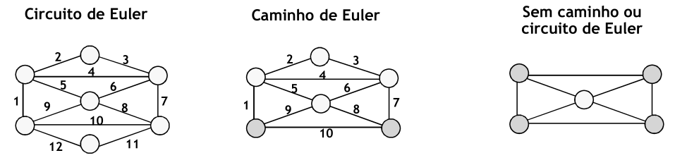
</td>

<td>

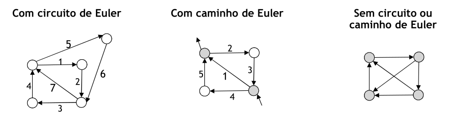
</td>
</tr>

</table>

-----

## Pesquisa em Profundidade

Se o grafo satisfizer as condições necessárias e suficientes, esta pesquisa termina necessariamente no vértice de partida, formando um circuito, embora não necessariamente de Euler

<table>

<td width="60%">

1. Escolher um vértice qualquer e efetuar uma pesquisa em profundidade a partir desse vértice
2. Enquanto existirem arestas por visitar
   1. Procurar o primeiro vértice no caminho (circuito) obtido até ao momento que possua uma aresta não percorrida
   2. Lançar uma sub-pesquisa em profundidade a partir desse vértice (sem voltar a percorrer arestas já percorridas)
   3. Inserir o resultado (circuito) no caminho principal
</td>

<td>
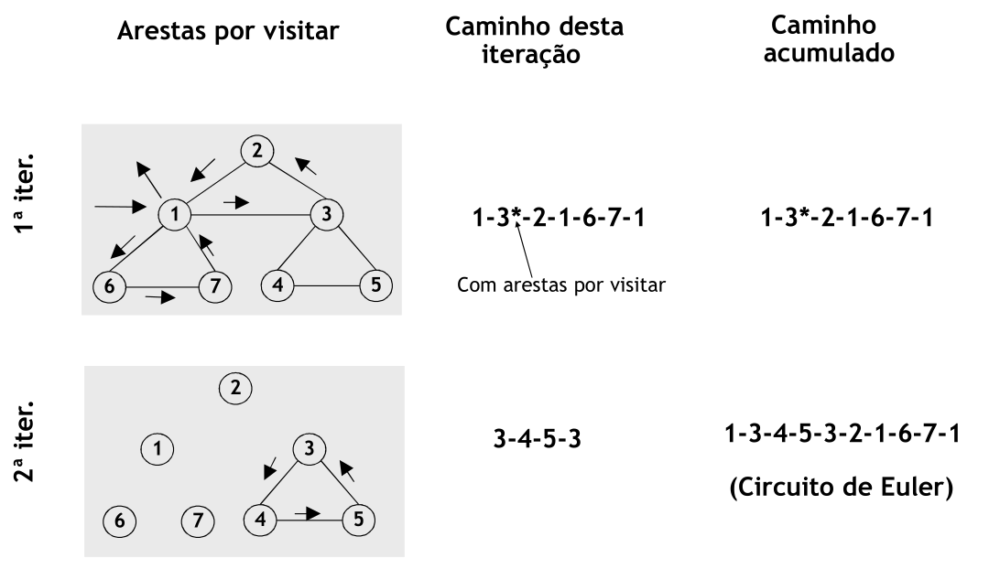

> Tempo de execução: O(|E| + |V|)
> Cada vértice e aresta é percorrido uma única vez -  Usam-se listas ligadas para efetuar inserções em tempo constante
</td>

</table>

### Problema do carteiro chinês

Dado um grafo pesado conexo G=(V,E), encontrar um caminho fechado (i.e., com início e fim no mesmo vértice) de peso mínimo que atravesse cada aresta de G pelo menos uma vez é o **percurso ótimo do carteiro Chinês**. A um caminho fechado (não necessariamente de peso mínimo) que atravesse cada aresta pelo menos uma vez chama-se **percurso do carteiro**.

> Se o grafo G não for Euleriano, pode-se construir um grafo Euleriano G* duplicando algumas arestas de G, selecionadas por forma a conseguir um grafo Euleriano com peso total mínimo.

----

## Grafos não dirigidos

<table>
<tr>
<td>

1. Achar todos os vértices de grau ímpar em G. Seja k o número (par!) destes vértices. Se k=0, fazer G*=G e saltar para o passo 6.
2. Achar os caminhos mais curtos e distâncias mínimas entre todos os pares de vértices de grau ímpar em G.
</td>

<td>

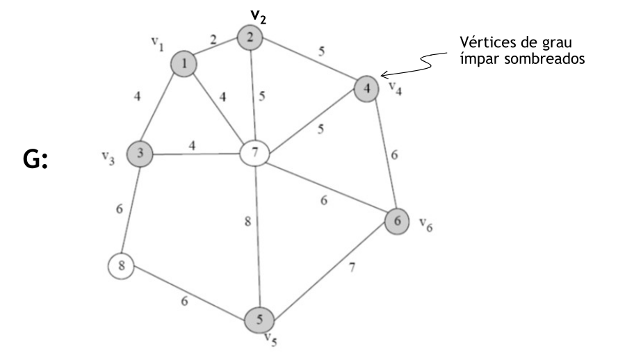
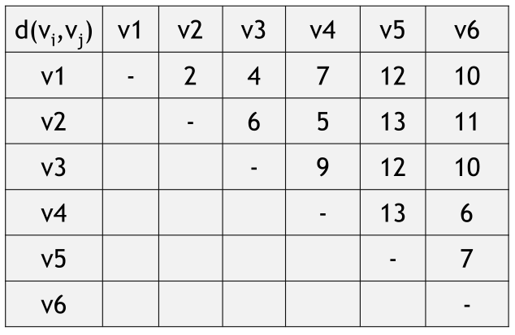
</td>
</tr>

<tr>
<td>

3. Construir um grafo completo G' com os vértices de grau ímpar de G ligados entre si por arestas de peso igual à distância mínima calculada no passo 2.

4. Encontrar um emparelhamento perfeito (envolvendo todos os vértices) de peso mínimo em G'. Isto corresponde a emparelhar os vértices de grau ímpar de G, minimizando a soma das distâncias entre vértices emparelhados.
</td>

<td>

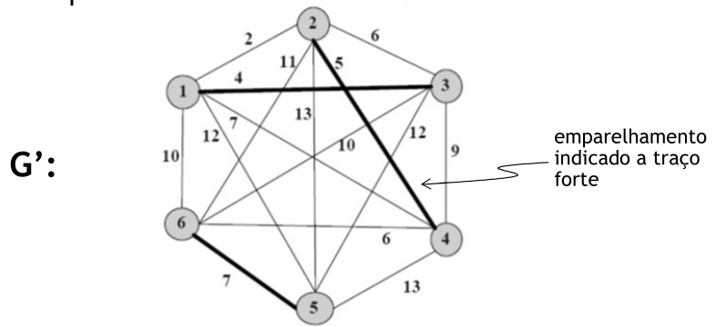
</td>
</tr>
<tr>
<td>

5. Para cada par (u, v) no emparelhamento perfeito obtido, adicionar pseudo-arestas (arestas paralelas duplicadas) a G ao longo de um caminho mais curto entre u e v. Seja G* o grafo resultante.
6. Achar um circuito de Euler em G*. Este circuito é um percurso ótimo do carteiro Chinês.
</td>

<td>

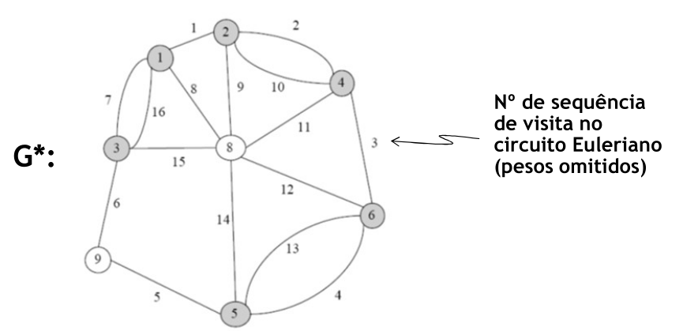
</td>
</tr>
</table>

----

## Grafos dirigidos

<table>
<tr>
<td>

1. No grafo G dado, identificar os vértices com nos diferentes de arestas a entrar e a sair
2. Determinar os caminhos mais curtos de vértices que têm défice de saídas para vértices que têm défice de entradas e representar as distâncias respetivas num grafo bipartido G’. 
> Os Vértices são anotados com multiplicidade (número de parelhas em que deve participar) igual ao défice absoluto
</td>

<td>

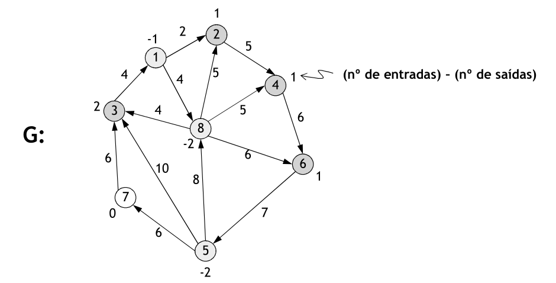
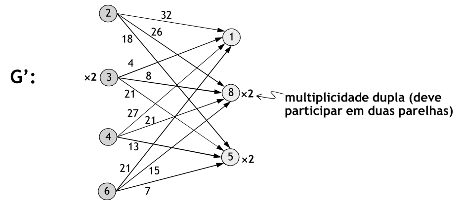
</td>
</tr>

<tr>
<td>

3. Formular problema de emparelhamento óptimo como problema de fluxo máximo de custo mínimo e resolver.

</td>

<td>

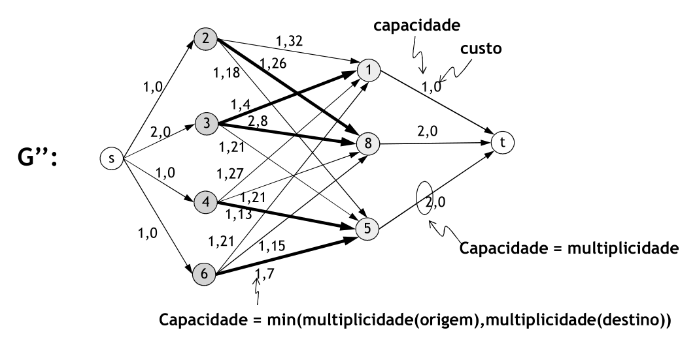
</td>
</tr>
<tr>
<td>

4. Obter grafo Euleriano G*, duplicando em G os caminhos mais curtos entre os vértices emparelhados no passo 3, e obter um circuito Euleriano.
</td>

<td>

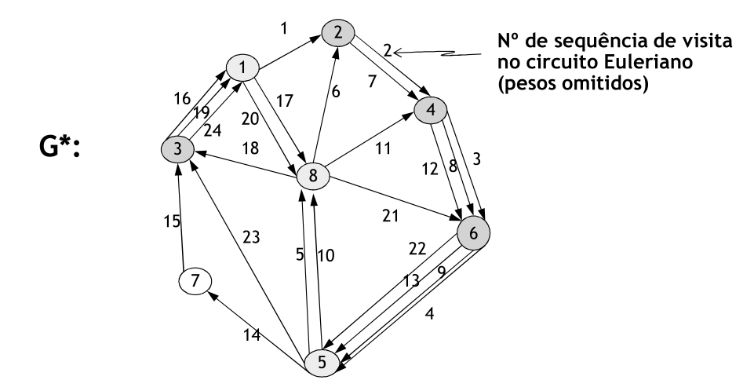
</td>
</tr>
</table>
